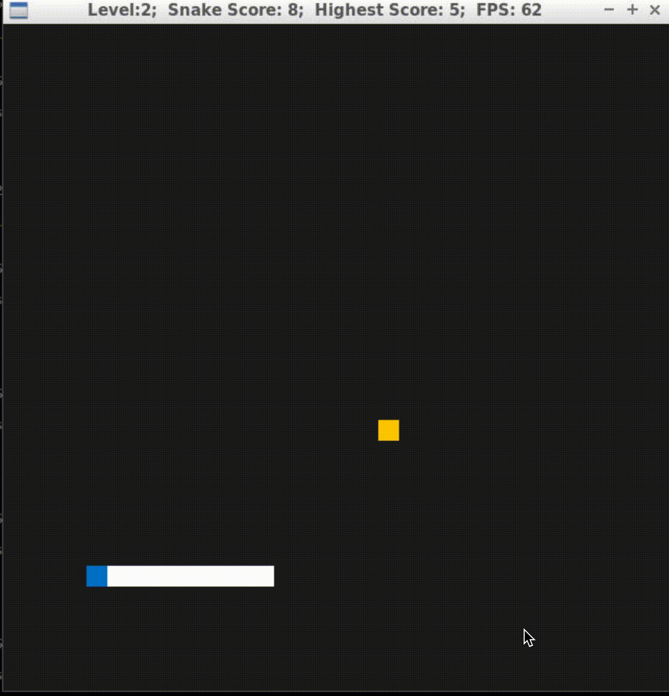

# CPPND: Capstone Snake Game

This C++ project is the fifth and final project of the Udacity C++ Nanodegree. This code was implemented to satisfy all the criteria for the Rubric, and at least 5 of the total criteria were met.
This project was developed from the (Udacity's repo)[https://github.com/udacity/CppND-Capstone-Snake-Game].

# CPPND: Project Requirements

### A. Introduction:

1. After starting up the game, the user is asked what level he/she wants to play. The level will determin the difficulty of the game. When the game is finished, the high score is update the the user's socre exceed the present high score.

2. The user interface includes: The Level of the game, The present game score, The prevoius highest score, and the FPS.

3. User can terminate the program by pressing Ctrl+C

The code for this repo was inspired by [this](https://codereview.stackexchange.com/questions/212296/snake-game-in-c-with-sdl) excellent StackOverflow post and set of responses.

## Dependencies for Running Locally
* cmake >= 3.7
  * All OSes: [click here for installation instructions](https://cmake.org/install/)
* make >= 4.1 (Linux, Mac), 3.81 (Windows)
  * Linux: make is installed by default on most Linux distros
  * Mac: [install Xcode command line tools to get make](https://developer.apple.com/xcode/features/)
  * Windows: [Click here for installation instructions](http://gnuwin32.sourceforge.net/packages/make.htm)
* SDL2 >= 2.0
  * All installation instructions can be found [here](https://wiki.libsdl.org/Installation)
  >Note that for Linux, an `apt` or `apt-get` installation is preferred to building from source. 
* gcc/g++ >= 5.4
  * Linux: gcc / g++ is installed by default on most Linux distros
  * Mac: same deal as make - [install Xcode command line tools](https://developer.apple.com/xcode/features/)
  * Windows: recommend using [MinGW](http://www.mingw.org/)

## Basic Build Instructions

1. Clone this repo.
2. Make a build directory in the top level directory: `mkdir build && cd build`
3. Compile: `cmake .. && make`
4. Run it: `./SnakeGame`.

## CC Attribution-ShareAlike 4.0 International

Shield: [![CC BY-SA 4.0][cc-by-sa-shield]][cc-by-sa]

This work is licensed under a
[Creative Commons Attribution-ShareAlike 4.0 International License][cc-by-sa].

[![CC BY-SA 4.0][cc-by-sa-image]][cc-by-sa]

[cc-by-sa]: http://creativecommons.org/licenses/by-sa/4.0/
[cc-by-sa-image]: https://licensebuttons.net/l/by-sa/4.0/88x31.png
[cc-by-sa-shield]: https://img.shields.io/badge/License-CC%20BY--SA%204.0-lightgrey.svg

Rubric Items Matched

1. Loops, Functions, I/O - The project accepts user input and processes the input.The project accepts input from a user as part of the necessary operation of the program.  The user has the option to select levels in the game. The levels determine how hard it is to play the game. The level affects the speed of the snake as it eats food. The game has three levels: Level 1(0.01 speed increase), Level 2(0.03 speed increase), Level 3(0.06 speed increas.A game class member function "void UpdateGameLevel()" is called in the main function (line 17). This memeber function encapsulates the Game's private data member snake and calls the Snake class member function "SetDifficulty()" (game.cpp line 55)

2. I/O - This application read and write the file. The HighScore Class is used to read and write the highest score in the game.

3. The project uses Object Oriented Programming techniques. This project support OOP techniques. For exmaple, a SysInfo class was created (inside system_info.h) to keep information about the system platform. This has member functions getPlatform and printPlatform.

4. Classes use appropriate access specifiers for class members. -->  In the system_info.h, a private variable systemPlatform (line 24) stores the user's detected system and no other class can modify this vavriable

5. Loops, Functions --> The security mechanism in OOP were used to avoid common pitfalls. 

